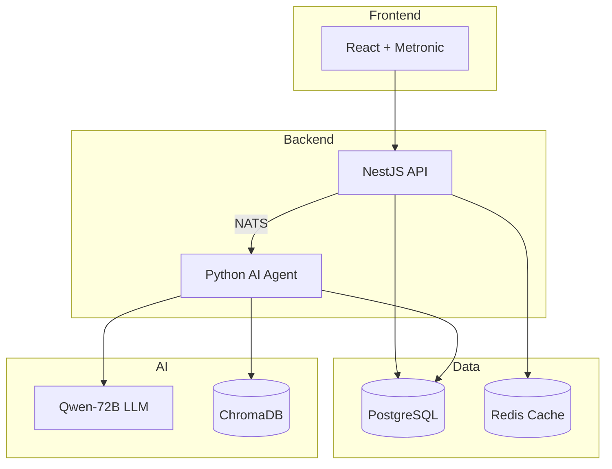

# 🏭 Sentient Factory

> **AI-Powered Manufacturing ERP System**
> Combining traditional ERP reliability with cutting-edge AI intelligence

---

## 🎯 Overview

**Sentient Factory** adalah sistem ERP manufacturing modern yang mengintegrasikan AI untuk memberikan insights real-time, automated decision support, dan natural language interface untuk operasional pabrik.

### ✨ Key Features

| Module                  | Description                                  |
| ----------------------- | -------------------------------------------- |
| **Sales Order (SO)**    | Quote-to-cash dengan AI pricing suggestion   |
| **Purchase Order (PO)** | Procurement dengan vendor scoring            |
| **Work Order (WO)**     | Production tracking dengan anomaly detection |
| **Inventory**           | Real-time stock dengan predictive alerts     |
| **AI Chat**             | Natural language query ke business data      |
| **Executive Hub**       | CEO briefing via WhatsApp                    |

### 🏗️ Architecture



---

## 🚀 Quick Start

### Prerequisites

```bash
# Required
Node.js 20+
Python 3.11+
PostgreSQL 15+
Redis 7+
Docker & Docker Compose

# Optional (for local AI)
Ollama (Mac/Linux)
```

### Installation

```bash
# Clone repository
git clone https://github.com/your-org/sentient-factory.git
cd sentient-factory

# Install dependencies
npm install                    # Frontend
cd backend && npm install     # Backend
cd ../ai-service && pip install -r requirements.txt  # Python

# Setup environment
cp .env.example .env
# Edit .env with your configuration

# Start services
docker-compose up -d          # PostgreSQL, Redis, NATS
npm run dev                   # Frontend (localhost:3000)
npm run start:dev             # Backend (localhost:8000)
python -m app.main            # AI Service
```

### Default Login

```
Username: admin
Password: Password123!
```

---

## 🛠️ Tech Stack

| Layer          | Technology                        | Version   |
| -------------- | --------------------------------- | --------- |
| **Frontend**   | React + TypeScript                | 18.x      |
| **Template**   | Metronic                          | 9.3.7     |
| **State**      | Zustand + React Query             | 4.x / 5.x |
| **Backend**    | NestJS + TypeScript               | 10.x      |
| **Database**   | PostgreSQL                        | 15.x      |
| **Cache**      | Redis                             | 7.x       |
| **Messaging**  | NATS                              | 2.x       |
| **AI Service** | Python + LangChain                | 3.11+     |
| **LLM**        | Qwen-72B (local) / Gemini (cloud) | -         |

---

## 📚 Documentation

### Foundation
- [📋 Project Rules](rules.md) - Master document, business rules
- [🎯 Marketing Pitch](marketing.md) - Product positioning

### Analysis
- [📊 System Analysis](system_analysis.md) - ERD, Data Model
- [🔄 BPA-1: Core System](bpa-1.md) - Auth, Dashboard, Users
- [🔄 BPA-2: Transactions](bpa-2.md) - SO, PO, WO, Inventory
- [🔄 BPA-3: AI Features](bpa-3.md) - Chat, Alerts, Reports

### Design & Architecture
- [🎨 UI Design](ui-design.md) - Wireframes, Components
- [🏗️ Architecture](architecture.md) - System design, Data flow

### Development
- [💻 Frontend Spec](frontend.md) - React, Metronic, Hooks
- [🔧 Backend Spec](backend.md) - NestJS, JWT, RBAC
- [📜 API Contract](api-contract.md) - Request/Response schemas
- [🗄️ Database Scripts](database.md) - DDL, Triggers, Seed data
- [🐍 Python AI Service](python-ai.md) - Agentic framework
- [🚀 Deployment](deployment.md) - Docker, CI/CD

### AI & Prompting
- [🗣️ Master Prompting](master_prompting.md) - Prompt templates
- [🖥️ AI Setup (Mac M4)](ai-setup.md) - Local LLM setup
- [☁️ AI Setup (Gemini)](ai-gemini.md) - Cloud AI for development

### Quality
- [🧪 QA Documentation](qa.md) - Test cases, E2E testing
- [🔒 Security](security.md) - Auth, OWASP, Compliance

---

## 👥 Team Structure

| Role              | Responsibility                  |
| ----------------- | ------------------------------- |
| **Product Owner** | Requirements, Prioritization    |
| **Tech Lead**     | Architecture, Code Review       |
| **Frontend Dev**  | React, Metronic implementation  |
| **Backend Dev**   | NestJS, API development         |
| **AI Engineer**   | Python service, LLM integration |
| **QA Engineer**   | Testing, Quality assurance      |
| **DevOps**        | Deployment, Infrastructure      |

---

## 📄 License

Proprietary - All rights reserved.

---

*Last Updated: 2024-12-27*
