# 🏗️ Architecture & Development Guide

Dokumen ini menjelaskan arsitektur teknis detail untuk implementasi "Sentient Factory", dengan fokus pada stack **PostgreSQL** dan integrasi template **Metronic v9.3.7**.

## 1. High-Level Stack

| Komponen                | Teknologi              | Keterangan                                                                        |
| :---------------------- | :--------------------- | :-------------------------------------------------------------------------------- |
| **User Interface (FE)** | **Metronic v9.3.7**    | Menggunakan versi (Recommend: React/Next.js) dari paket Metronic untuk Dashboard. |
| **Database (DW)**       | **PostgreSQL**         | Data Warehouse terpusat hasil *mirroring* dari Client ERP.                        |
| **Backend & Logic**     | **NestJS / Python**    | API Layer untuk Transaction dan AI Inference.                                     |
| **Orchestrator**        | **Node-RED**           | Flow-based programming untuk trigger alert & automation.                          |
| **AI Inference**        | **Qwen-2.5-72B**       | Berjalan di Mac Mini M4 Pro (Local/Offline).                                      |
| **Messaging**           | **WhatsApp (Baileys)** | Library koneksi WA untuk "Executive Hub".                                         |
| **Message Broker**      | **NATS**               | Komunikasi antar microservice (Pub-Sub, JetStream).                               |

---

## 2. Implementasi Frontend (Metronic v9.3.7)

Kita menggunakan **Metronic v9.3.7** sebagai fondasi UI untuk mempercepat development, memastikan tampilan *Enterprise Grade* yang konsisten dan premium.

### Strategi Adaptasi Template
*   **Layout**: Gunakan *Sidebar Layout* (Default Metronic) untuk navigasi antar modul (SO, DO, WO, dll).
*   **Theme Mode**: Paksa **Dark Mode** secara default (atau sediakan toggle) sesuai persona industri yang modern.
*   **Components to Use**:
    *   **Widgets**: Gunakan *Mixed Widget* untuk KPI (Revenue, OEE).
    *   **DataTables**: Gunakan tabel Metronic yang *advanced* (Sort, Filter, Export) untuk list Sales Order/Work Order.
    *   **Charts**: Gunakan **ApexCharts** (bawaan Metronic) untuk visualisasi tren.

### Struktur Halaman Dashboard
1.  **Executive Overview (CEO)**:
    *   *Metronic Widget*: "Stats Widget 1" untuk total Revenue, Profit, Cash.
    *   *Chart*: Tren sales mingguan vs target.
2.  **Operational Pulse (Manager)**:
    *   *Table*: Daftar anomali aktif (Mesin error, DO telat).
    *   *Timeline*: Tracking status pengiriman live.

---

## 3. Desain Database (PostgreSQL)

Database PostgreSQL berfungsi sebagai **Read-Model** (Data Warehouse) yang dioptimalkan untuk query AI, terpisah dari DB Transaksional ERP lama agar tidak mengganggu performa.

### Schema: `sentient_warehouse`

#### A. Core Data (Mirroring ERP)
Table ini diisi oleh proses ETL/CDC dari ERP Client.
*   `fact_sales_orders` (no_so, customer, amount, status, date)
*   `fact_production_logs` (machine_id, shift, output, reject, downtime_reason)
*   `dim_customers` (id, name, address, credit_limit)
*   `dim_items` (sku, name, cost, category)

#### B. AI Insight & Logs
Table ini menyimpan hasil pemikiran AI.
*   `ai_anomalies`:
    *   `id` (UUID)
    *   `source_module` (e.g., 'PO', 'WO')
    *   `severity` ('Low', 'Medium', 'Critical')
    *   `description` (e.g., "Harga beli naik tidak wajar")
    *   `ai_reasoning` (Text penjelasan dari LLM)
    *   `is_resolved` (Boolean)
*   `chat_history`: (Untuk fitur Executive Hub WA)
    *   `user_phone`
    *   `message_in`
    *   `message_out`
    *   `timestamp`

---

## 4. Alur Data (Data Flow)

```mermaid
graph TD
    Legacy["🗄️ Legacy ERP (Client DB)"] -->|CDC / Nightly Sync| PG[("🐘 PostgreSQL DW")]
    
    subgraph NodeA ["Node A: AI Brain"]
        LLM["🧠 Qwen-72B (Mac Mini)"]
    end
    
    subgraph NodeB ["Node B: App Server"]
        PG -->|Query| API["⚙️ Backend API"]
        Metronic["🖥️ Metronic Dashboard"] <-->|JSON| API
        WA["💬 WhatsApp Service"] <--> API
        API -->|Prompt Context| LLM
        LLM -->|Insight| API
    end
    
    User(("👤 User")) --> Metronic
    User --> WA
```

1.  **Ingestion**: Python script menyalin data baru/berubah dari Legacy ERP ke PostgreSQL.
2.  **Analysis**: Node-RED/Python Scheduler mengecek data baru di PostgreSQL setiap 10 menit.
3.  **Inference**: Jika ada anomali (misal: reject rate > 5%), data dikirim ke Mac Mini (LLM) untuk dianalisa penyebabnya.
### 4.1 Detail Flow: AI Agentic Reasoning (Python Orchestrator)

Diagram ini menggambarkan request kompleks yang membutuhkan **Multi-Step Reasoning** (Agentic Pattern). Python bertindak sebagai "Brain" yang melakukan loop *Thought-Action-Observation*.

**Skenario**: User bertanya *"Kenapa profit margin bulan ini turun?"*

```mermaid
sequenceDiagram
    participant User as "👤 User"
    participant Nest as "⚙️ NestJS (App Logic)"
    participant Py as "🐍 Python Agent (Service)"
    participant LLM as "🧠 Qwen-72B"
    participant DB as "🐘 PostgreSQL (DW)"

    Note over User, Nest: 1. Request Masuk
    User->>Nest: GET /ask?q="Kenapa margin turun?"
    Nest->>Nest: Validate Auth & Rate Limit
    Nest->>Py: Forward Query (HTTP/gRPC)

    loop Agentic Reasoning Loop (Python)
        Note over Py, LLM: Cycle 1: Hipotesa Awal
        Py->>LLM: Prompt: "Start thinking. Tool: SQL_Query"
        LLM->>Py: Thought: "Cek tren COGS bulan ini."<br/>Action: SELECT sum(cogs) FROM sales...
        Py->>DB: Execute Query 1
        DB-->>Py: Result: "COGS naik 15%"
        
        Note over Py, LLM: Cycle 2: Deep Dive penyebab
        Py->>LLM: Obs: "COGS naik. What next?"
        LLM->>Py: Thought: "Cek harga bahan baku utama."<br/>Action: SELECT price FROM materials...
        Py->>DB: Execute Query 2
        DB-->>Py: Result: "Harga Tembaga naik 20%"
        
        Note over Py, LLM: Cycle 3: Final Conclusion
        Py->>LLM: Obs: "Tembaga naik. Summarize."
        LLM-->>Py: Final Answer: "Margin tergerus 5% karena kenaikan harga Tembaga dunia."
    end

    Note over Nest: Custom Biz Logic layer
    Py-->>Nest: JSON Response {answer, confidence, sources}
    Nest->>Nest: Format Currency, Save Log, Check Alert Rules
    Nest-->>User: Display Response
```

**Keterangan Role:**
*   **NestJS**: Gatekeeper & Business Logic (Auth, Formatting, Saving interactions).
*   **Python**: **Pure AI Agent**. Hanya fokus pada logika "Berpikir" dan orkestrasi tools (SQL, RAG).
*   **Loop**: Terjadi di layer Python, meminimalkan traffic bolak-balik ke main app (NestJS).

**Penjelasan Alur (Step-by-Step):**

1.  **Request Masuk (The Trigger)**
    *   User mengirim pertanyaan natural: *"Kenapa margin turun?"*.
    *   **NestJS** bertindak sebagai satpam: memvalidasi apakah user punya hak akses, mencegah spam (Rate Limit), dan membersihkan input.

2.  **Agentic Loop (The Brainstorming)** - *Disinilah "Thinking" terjadi*:
    *   **Cycle 1 (Investigasi Awal)**: Python Agent bertanya ke LLM, "Harus mulai dari mana?". LLM menjawab "Cek dulu data COGS (Cost of Goods Sold)". Agent mengeksekusi Query SQL ke PostgreSQL.
    *   **Observation**: Hasil Query menunjukan COGS naik 15%. Ini adalah *clue* pertama.
    *   **Cycle 2 (Deep Dive)**: Agent memberikan data COGS ke LLM. LLM berpikir: "Kalau COGS naik, biasanya bahan baku naik. Cek harga material." Agent mengeksekusi Query ke-2.
    *   **Observation**: Ternyata harga Tembaga dunia naik 20%. *Root Cause* ditemukan.
    *   **Cycle 3 (Conclusion)**: LLM merasa data sudah cukup. Ia merangkum temuan menjadi kalimat jawaban final.

3.  **Response & Action (The Delivery)**
    *   Jawaban dari Python dikembalikan ke NestJS.
    *   **NestJS** mempercantik jawaban: memformat angka "20000" menjadi "Rp 20.000,00", menyimpan log percakapan ke DB untuk audit, dan jika isunya kritis, NestJS bisa men-trigger notifikasi WhatsApp.

1.  **Setup Metronic**: Extract template, bersihkan komponen demo yang tidak dipakai.
2.  **Connect Auth**: Buat halaman Login (Metronic Authentication) proteksi akses.
3.  **Build Core Modules**:
    *   Buat 1 halaman *Master Layout*.
    *   Implementasi halaman **Sales Order** (Tabel + Chart).
    *   Implementasi halaman **Production** (Timeline + Status).
4.  **Integrasi AI**: Tambahkan tombol "Ask AI" di setiap baris tabel yang memanggil API ke Qwen-72B untuk penjelasan detail data tersebut.

---

### 4.2 Edge Case Skenario: "The Impossible Rush Order" (Complex Planning)

Ini adalah *stress-test* untuk kapabilitas AI menangani **Konflik Sumber Daya** dan **Simulasi Bisnis**.

**Kasus**: Sales Manager bertanya: *"Bisa tidak kita terima Urgent Order 5.000 unit dari Customer VIP? Deadline Jumat depan. Padahal jadwal mesin penuh."*

**Tantangan (Complexity)**:
1.  **Cek Stok**: Barang jadi tidak ada.
2.  **Cek Kapasitas**: Mesin produksi penuh (Fully Booked).
3.  **Cek Material**: Bahan baku ada, tapi terbatas.
4.  **Decision Making**: Harus ada order lain yang dikorbankan. Mana yang paling "murah" untuk digeser?

```mermaid
sequenceDiagram
    participant Sales as "🤵 Sales Mgr"
    participant Py as "🐍 AI Orchestrator"
    participant LLM as "🧠 Qwen-72B"
    participant DB as "🐘 ERP DB"

    Sales->>Py: "Terima Order 5k Unit (VIP)? Deadline Jumat."
    
    loop Deep Reasoning & Simulation
        Note over Py, LLM: Phase 1: Fact Checking
        Py->>LLM: "Cek ketersediaan stok & kapasitas."
        Py->>DB: CHECK stock_fg, machine_schedule
        DB-->>Py: Stock=0, Machine=FULL (Order #101, #102)
        
        Note over Py, LLM: Phase 2: Material Check
        Py->>LLM: "Kalau mesin dipaksa jalan, bahan cukup?"
        Py->>DB: CHECK raw_material_stock
        DB-->>Py: Material OK (Cukup)
        
        Note over Py, LLM: Phase 3: Conflict Resolution (The Magic)
        LLM->>Py: Thought: "Mesin penuh. Cari order existing yang 'Low Priority' atau 'Low Margin' untuk digeser."
        Py->>DB: SELECT * FROM production_queue WHERE priority='Low'
        DB-->>Py: Found: Order #102 (Customer Reguler, Margin Kecil, Penalty Delay Murah)
        
        Note over Py, LLM: Phase 4: Business Simulation
        LLM->>Py: Thought: "Simulasi: Geser Order #102 mundur 3 hari. Hitung cost."
        Py->>Py: Calc: Profit VIP (Rp 750jt) vs Penalty Delay #102 (Rp 30jt)
        LLM-->>Py: Conclusion: "Profitable. Swap jadwal aman."
    end
    
    Py-->>Sales: "✅ BISA DITERIMA. Syarat: Order #102 digeser mundur 3 hari. (Net Profit +Rp 720jt). Klik untuk Approve Reschedule."
```

**Kenapa Skenario Ini "Enterprise Grade"?**
*   **Multi-Constraint**: AI tidak berhenti saat melihat "Mesin Penuh" (Jawaban naif: "Tidak Bisa").
*   **Creative Solving**: AI mencari jalan keluar (Trade-off) dengan menggeser order lain.
*   **Financial Impact**: Keputusan berbasis ROI (Profit vs Penalty), bukan hanya teknis.

**Penjelasan Alur (Step-by-Step):**

1.  **Phase 1: Fact Checking (Cek Fakta)**
    *   AI tidak langsung percaya user. Ia mengecek Database Stock Barang Jadi (0 Unit) dan Jadwal Mesin (Full).
    *   Jika AI biasa, proses berhenti disini dan jawab "Tolak". Tapi Agentic AI lanjut berpikir.

2.  **Phase 2: Material Availability (Cek Bahan)**
    *   "Oke kapasitas penuh, tapi kalau dipaksakan, bahannya ada gak?"
    *   AI mengecek gudang bahan baku. Hasil: Bahan cukup. Masalah tinggal di **Kapasitas Mesin**.

3.  **Phase 3: Conflict Resolution (Cari Korban)**
    *   AI mencari order mana di jadwal yang bisa digeser. Syaratnya: *Low Priority* atau margin tipis.
    *   Ditemukan **Order #102**, milik customer reguler yang dendanya murah jika telat.

4.  **Phase 4: Business Simulation (Hitung Cuan)**
    *   AI melakukan simulasi matematika ekonomi:
        *   Keuntungan terima Order VIP: **+Rp 750.000.000**
        *   Kerugian denda geser Order #102: **-Rp 30.000.000**
        *   Net Benefit: **+Rp 720.000.000**.
    *   **Keputusan**: Secara bisnis, ini *Worthy*. AI menyarankan Ops Manager untuk lakukan swap ini.

