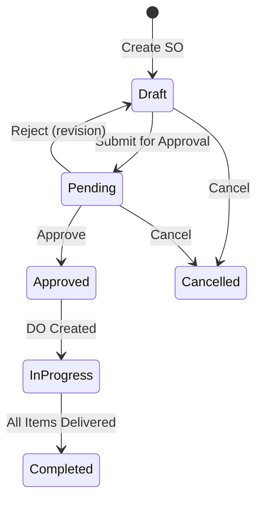
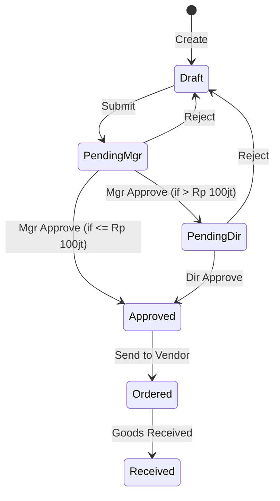

# 📋 BPA-2: Transaction Modules

> **Business Process Analysis - Phase 2**
> Target: UI/UX & Frontend Team

---

## 1. Overview

BPA-2 mencakup modul **transaksi bisnis utama** yang memproses data operasional harian.

| Modul                   | Priority | Kompleksitas |
| ----------------------- | -------- | ------------ |
| Sales Order (SO)        | P0       | High         |
| Delivery Order (DO)     | P0       | Medium       |
| Purchase Order (PO)     | P0       | High         |
| Work Order (WO)         | P0       | High         |
| Inventory Management    | P0       | Medium       |
| Account Receivable (AR) | P1       | Medium       |
| Account Payable (AP)    | P1       | Medium       |

---

## 2. Sales Order (SO) Module

### 2.1 User Stories

```
AS A sales staff
I WANT TO create sales orders
SO THAT customer orders are recorded in the system

AS A sales manager
I WANT TO approve sales orders
SO THAT only valid orders proceed to delivery
```

### 2.2 Features

| Feature            | Description                                  | Actor         |
| ------------------ | -------------------------------------------- | ------------- |
| **List SO**        | Table with status filter, search, pagination | All           |
| **Create SO**      | Form input customer, items, qty, price       | Sales Staff   |
| **Edit SO**        | Edit draft SO (before approval)              | Sales Staff   |
| **View SO Detail** | Read-only detail dengan print option         | All           |
| **Approve SO**     | Approve/reject dengan notes                  | Sales Manager |
| **Cancel SO**      | Cancel with reason (audit logged)            | Sales Manager |
| **Print SO**       | Generate PDF for customer                    | All           |

### 2.3 SO Status Flow



### 2.4 List View Columns

| Column       | Sortable | Filterable     | Format            |
| ------------ | -------- | -------------- | ----------------- |
| SO Number    | ✅        | ✅ (search)     | SO-YYYYMM-XXXX    |
| Customer     | ✅        | ✅ (dropdown)   | Name              |
| Order Date   | ✅        | ✅ (date range) | DD/MM/YYYY        |
| Total Amount | ✅        | ❌              | Rp xxx,xxx        |
| Status       | ✅        | ✅ (dropdown)   | Badge color       |
| Actions      | ❌        | ❌              | View, Edit, Print |

### 2.5 Create/Edit Form

#### Header Section
| Field        | Type         | Validation      | Required |
| ------------ | ------------ | --------------- | -------- |
| Customer     | Autocomplete | From m_cust     | ✅        |
| Order Date   | Date Picker  | Today or future | ✅        |
| PO Reference | Text         | Max 50 char     | ❌        |
| Notes        | Textarea     | Max 500 char    | ❌        |

#### Detail Section (Line Items)
| Field      | Type         | Validation             | Required |
| ---------- | ------------ | ---------------------- | -------- |
| Item       | Autocomplete | From m_item            | ✅        |
| Qty        | Number       | Min 1, Max stock       | ✅        |
| Unit Price | Currency     | From m_item (editable) | ✅        |
| Discount % | Number       | 0-100                  | ❌        |
| Subtotal   | Calculated   | Qty × Price × (1-Disc) | Auto     |

#### Footer Section
| Field             | Description         |
| ----------------- | ------------------- |
| Subtotal          | Sum of line items   |
| Discount (Header) | Additional discount |
| Tax (PPN 11%)     | Calculated          |
| **Grand Total**   | Final amount        |

### 2.6 Wireframe: SO Create Form

```
┌─────────────────────────────────────────────────────────────┐
│ Create Sales Order                              [SAVE DRAFT]│
├─────────────────────────────────────────────────────────────┤
│                                                             │
│  Customer*     [PT ABC Manufacturing        ▼]              │
│  Order Date*   [27/12/2024]                                │
│  PO Reference  [PO-CUST-12345            ]                  │
│                                                             │
├─────────────────────────────────────────────────────────────┤
│  LINE ITEMS                                       [+ Add]   │
│ ┌───┬──────────────┬───────┬────────────┬──────┬──────────┐│
│ │ # │ Item         │ Qty   │ Unit Price │ Disc │ Subtotal ││
│ ├───┼──────────────┼───────┼────────────┼──────┼──────────┤│
│ │ 1 │ Widget A     │ 100   │ 50,000     │ 5%   │ 4,750,000││
│ │ 2 │ Widget B     │ 50    │ 75,000     │ 0%   │ 3,750,000││
│ │   │              │       │            │      │          ││
│ └───┴──────────────┴───────┴────────────┴──────┴──────────┘│
│                                                             │
│                              Subtotal      Rp  8,500,000   │
│                              Discount (2%) Rp   (170,000)   │
│                              PPN 11%       Rp    915,300   │
│                              ─────────────────────────────  │
│                              GRAND TOTAL   Rp  9,245,300   │
│                                                             │
│  Notes:                                                     │
│  [Delivery to warehouse A, contact Pak Budi               ]│
│                                                             │
├─────────────────────────────────────────────────────────────┤
│                        [CANCEL]  [SAVE DRAFT]  [SUBMIT]     │
└─────────────────────────────────────────────────────────────┘
```

### 2.7 API Endpoints

| Method | Endpoint                          | Description                   |
| ------ | --------------------------------- | ----------------------------- |
| GET    | `/api/sales-orders`               | List SO (paginated, filtered) |
| GET    | `/api/sales-orders/:uuid`         | Get SO detail with lines      |
| POST   | `/api/sales-orders`               | Create SO (draft)             |
| PUT    | `/api/sales-orders/:uuid`         | Update SO                     |
| POST   | `/api/sales-orders/:uuid/submit`  | Submit for approval           |
| POST   | `/api/sales-orders/:uuid/approve` | Approve SO                    |
| POST   | `/api/sales-orders/:uuid/reject`  | Reject SO (with notes)        |
| POST   | `/api/sales-orders/:uuid/cancel`  | Cancel SO                     |
| GET    | `/api/sales-orders/:uuid/pdf`     | Generate PDF                  |

---

## 3. Delivery Order (DO) Module

### 3.1 User Story

```
AS A warehouse staff
I WANT TO create delivery orders from approved SO
SO THAT shipments can be tracked and executed
```

### 3.2 Features

| Feature                    | Description                        |
| -------------------------- | ---------------------------------- |
| **Create DO from SO**      | Select SO, choose items to deliver |
| **List DO**                | Table with status, date filter     |
| **View DO Detail**         | Items, driver, vehicle info        |
| **Update Delivery Status** | Shipped, In Transit, Delivered     |
| **Print Surat Jalan**      | PDF with signature area            |

### 3.3 DO Status Flow

```
[SO Approved] → Create DO → [Pending] → Ship → [In Transit] → Confirm → [Delivered]
```

### 3.4 Form Fields

| Field            | Type         | Description              |
| ---------------- | ------------ | ------------------------ |
| SO Reference     | Autocomplete | Select approved SO       |
| Delivery Date    | Date         | Planned delivery date    |
| Driver           | Dropdown     | From m_emp (driver role) |
| Vehicle          | Text         | Plate number             |
| Items to Deliver | Table        | Checkbox from SO detail  |

---

## 4. Purchase Order (PO) Module

### 4.1 User Stories

```
AS A procurement staff
I WANT TO create purchase orders
SO THAT we can order materials from vendors

AS A procurement manager
I WANT TO approve purchase orders
SO THAT only authorized purchases proceed
```

### 4.2 Features

| Feature        | Description                   | Actor             |
| -------------- | ----------------------------- | ----------------- |
| **List PO**    | Table with status filter      | All               |
| **Create PO**  | Form input vendor, items, qty | Procurement       |
| **Edit PO**    | Edit draft PO                 | Procurement       |
| **Approve PO** | Multi-level approval          | Manager, Director |
| **Print PO**   | Generate PDF for vendor       | All               |

### 4.3 PO Status Flow



### 4.4 Approval Matrix

| Total Amount   | Approval Level                        |
| -------------- | ------------------------------------- |
| ≤ Rp 10 juta   | Procurement Manager                   |
| Rp 10-100 juta | Procurement Manager + Finance Manager |
| > Rp 100 juta  | + Director                            |

### 4.5 Form Similar to SO
- Header: Vendor, PO Date, Expected Delivery
- Detail: Items, Qty, Unit Price
- Footer: Subtotal, Tax, Total

---

## 5. Work Order (WO) Module

### 5.1 User Story

```
AS A production planner
I WANT TO create work orders for manufacturing
SO THAT production schedule can be tracked

AS A production operator
I WANT TO log production output
SO THAT actual production is recorded
```

### 5.2 Features

| Feature            | Description                             |
| ------------------ | --------------------------------------- |
| **Create WO**      | Item to produce, qty, machine, schedule |
| **List WO**        | Table with status, machine filter       |
| **Assign WO**      | Assign to machine, shift, operator      |
| **Log Production** | Record output, reject, downtime         |
| **Complete WO**    | Mark WO as finished                     |

### 5.3 WO Status Flow

```
[Created] → [Assigned] → [In Progress] → [Completed]
                              ↓
                         [On Hold]
```

### 5.4 Production Log Input (Shift Log)

| Field          | Type     | Description         |
| -------------- | -------- | ------------------- |
| WO Reference   | Dropdown | Select active WO    |
| Shift          | Dropdown | 1 / 2 / 3           |
| Output Qty     | Number   | Good output         |
| Reject Qty     | Number   | Rejected items      |
| Downtime (min) | Number   | Machine downtime    |
| Error Code     | Dropdown | Reason for downtime |
| Notes          | Text     | Additional notes    |

---

## 6. Inventory Management

### 6.1 Features

| Feature            | Description                                 |
| ------------------ | ------------------------------------------- |
| **Stock Overview** | List items with current stock per warehouse |
| **Stock Card**     | History of stock movements                  |
| **Stock Opname**   | Physical count adjustment                   |
| **Stock Transfer** | Move between warehouses                     |
| **Stock Alert**    | Show items below minimum                    |

### 6.2 Stock Overview Table

| Column        | Description               |
| ------------- | ------------------------- |
| Item Code     | Kode item                 |
| Item Name     | Nama item                 |
| Warehouse     | Lokasi gudang             |
| Current Stock | Saldo saat ini            |
| Reserved      | Dialokasikan untuk SO     |
| Available     | Current - Reserved        |
| Min Stock     | Minimum stock level       |
| Status        | 🟢 OK / 🟡 Low / 🔴 Critical |

### 6.3 Stock Movement Types

| Type     | Source | Description              |
| -------- | ------ | ------------------------ |
| SO_OUT   | t_so   | Keluar untuk sales order |
| DO_OUT   | t_do   | Keluar untuk delivery    |
| PO_IN    | t_po   | Masuk dari purchase      |
| WO_IN    | t_wo   | Masuk dari produksi      |
| WO_OUT   | t_wo   | Keluar untuk bahan baku  |
| ADJ_IN   | Manual | Adjustment masuk         |
| ADJ_OUT  | Manual | Adjustment keluar        |
| TRANSFER | Manual | Pindah gudang            |

---

## 7. Common UI Components (Reusable)

### 7.1 Data Table Standards

```
┌─────────────────────────────────────────────────────────────┐
│ [Search...        ]  [Status ▼]  [Date Range]  [+ Create]  │
├─────────────────────────────────────────────────────────────┤
│ ☐ │ Column 1 ↑ │ Column 2  │ Column 3  │ Status  │ Actions │
├───┼─────────────┼───────────┼───────────┼─────────┼─────────┤
│ ☐ │ Data 1      │ Data 2    │ Data 3    │ 🟢 Open │ ⋮       │
│ ☐ │ Data 1      │ Data 2    │ Data 3    │ 🔴 Close│ ⋮       │
├───┴─────────────┴───────────┴───────────┴─────────┴─────────┤
│              << 1 2 3 4 5 >>  │ Showing 1-10 of 234        │
└─────────────────────────────────────────────────────────────┘
```

### 7.2 Status Badge Colors

| Status      | Color  | Hex     |
| ----------- | ------ | ------- |
| Draft       | Gray   | #6B7280 |
| Pending     | Yellow | #F59E0B |
| Approved    | Green  | #10B981 |
| In Progress | Blue   | #3B82F6 |
| Completed   | Green  | #059669 |
| Cancelled   | Red    | #EF4444 |

### 7.3 Form Button Standards

| Button      | Color           | Position |
| ----------- | --------------- | -------- |
| Cancel      | Outline Gray    | Left     |
| Save Draft  | Outline Primary | Center   |
| Submit/Save | Primary Solid   | Right    |

---

## 8. Deliverables Checklist

### Sales Order
- [ ] SO List Page with filters
- [ ] SO Create Form
- [ ] SO Edit Form
- [ ] SO Detail View (read-only)
- [ ] SO Approval Modal
- [ ] SO Print/PDF Preview

### Delivery Order
- [ ] DO List Page
- [ ] DO Create from SO
- [ ] DO Status Update
- [ ] DO Print Surat Jalan

### Purchase Order
- [ ] PO List Page
- [ ] PO Create Form
- [ ] PO Approval Workflow UI
- [ ] PO Print

### Work Order
- [ ] WO List Page
- [ ] WO Create Form
- [ ] WO Assignment
- [ ] Production Log Input

### Inventory
- [ ] Stock Overview
- [ ] Stock Card History
- [ ] Stock Opname Form
- [ ] Stock Transfer Form
- [ ] Low Stock Alert Dashboard

---

*Document Version: 1.0*
*Last Updated: 2024-12-27*
