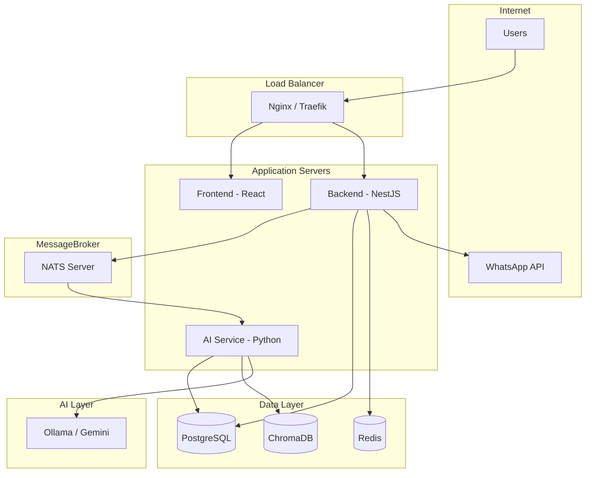

# 🚀 Deployment Guide

> **Parent Docs:** [Architecture](architecture.md), [Backend](backend.md)
> **Last Updated:** 2024-12-27

---

## 1. Architecture Overview



---

## 2. Docker Compose Setup

### 2.1 Directory Structure

```
sentient-factory/
├── docker-compose.yml
├── docker-compose.dev.yml
├── docker-compose.prod.yml
├── .env.example
├── frontend/
│   └── Dockerfile
├── backend/
│   └── Dockerfile
├── ai-service/
│   └── Dockerfile
└── infrastructure/
    ├── nginx/
    │   └── nginx.conf
    ├── postgres/
    │   └── init.sql
    └── vault/
        └── config.hcl
```

### 2.2 Docker Compose (Development)

```yaml
# docker-compose.dev.yml

version: '3.8'

services:
  # PostgreSQL Database
  postgres:
    image: postgres:15-alpine
    container_name: sentient-postgres
    environment:
      POSTGRES_DB: sentient_factory
      POSTGRES_USER: postgres
      POSTGRES_PASSWORD: ${DB_PASSWORD:-secret}
    ports:
      - "5432:5432"
    volumes:
      - postgres-data:/var/lib/postgresql/data
      - ./infrastructure/postgres/init.sql:/docker-entrypoint-initdb.d/init.sql
    healthcheck:
      test: ["CMD-SHELL", "pg_isready -U postgres"]
      interval: 10s
      timeout: 5s
      retries: 5

  # Redis Cache
  redis:
    image: redis:7-alpine
    container_name: sentient-redis
    ports:
      - "6379:6379"
    volumes:
      - redis-data:/data
    command: redis-server --appendonly yes
    healthcheck:
      test: ["CMD", "redis-cli", "ping"]
      interval: 10s
      timeout: 5s
      retries: 5

  # NATS Message Broker
  nats:
    image: nats:2-alpine
    container_name: sentient-nats
    ports:
      - "4222:4222"
      - "8222:8222"  # Monitoring
    command: ["-js", "-m", "8222"]

  # ChromaDB (Vector Database)
  chromadb:
    image: chromadb/chroma:latest
    container_name: sentient-chromadb
    ports:
      - "8000:8000"
    volumes:
      - chroma-data:/chroma/chroma

  # Vault (Secret Management)
  vault:
    image: vault:1.15
    container_name: sentient-vault
    cap_add:
      - IPC_LOCK
    ports:
      - "8200:8200"
    environment:
      VAULT_DEV_ROOT_TOKEN_ID: ${VAULT_TOKEN:-sentient-dev-token}
      VAULT_DEV_LISTEN_ADDRESS: "0.0.0.0:8200"
    volumes:
      - vault-data:/vault/data

volumes:
  postgres-data:
  redis-data:
  chroma-data:
  vault-data:
```

### 2.3 Docker Compose (Production)

```yaml
# docker-compose.prod.yml

version: '3.8'

services:
  # Nginx Reverse Proxy
  nginx:
    image: nginx:alpine
    container_name: sentient-nginx
    ports:
      - "80:80"
      - "443:443"
    volumes:
      - ./infrastructure/nginx/nginx.conf:/etc/nginx/nginx.conf:ro
      - ./infrastructure/nginx/ssl:/etc/nginx/ssl:ro
    depends_on:
      - frontend
      - backend
    restart: always

  # Frontend (React)
  frontend:
    build:
      context: ./frontend
      dockerfile: Dockerfile
    container_name: sentient-frontend
    environment:
      - VITE_API_URL=https://api.sentient.local/api
    restart: always

  # Backend (NestJS)
  backend:
    build:
      context: ./backend
      dockerfile: Dockerfile
    container_name: sentient-backend
    environment:
      - NODE_ENV=production
      - VAULT_ADDR=http://vault:8200
      - VAULT_TOKEN=${VAULT_TOKEN}
    depends_on:
      - postgres
      - redis
      - nats
      - vault
    restart: always

  # AI Service (Python)
  ai-service:
    build:
      context: ./ai-service
      dockerfile: Dockerfile
    container_name: sentient-ai
    environment:
      - VAULT_ADDR=http://vault:8200
      - VAULT_TOKEN=${VAULT_TOKEN}
      - NATS_URL=nats://nats:4222
    depends_on:
      - postgres
      - nats
      - chromadb
    restart: always

  # Infrastructure services...
  postgres:
    image: postgres:15-alpine
    environment:
      POSTGRES_DB: sentient_factory
      POSTGRES_USER: postgres
      POSTGRES_PASSWORD: ${DB_PASSWORD}
    volumes:
      - postgres-data:/var/lib/postgresql/data
    restart: always

  redis:
    image: redis:7-alpine
    command: redis-server --appendonly yes --requirepass ${REDIS_PASSWORD}
    volumes:
      - redis-data:/data
    restart: always

  nats:
    image: nats:2-alpine
    command: ["-js"]
    restart: always

  chromadb:
    image: chromadb/chroma:latest
    volumes:
      - chroma-data:/chroma/chroma
    restart: always

  vault:
    image: vault:1.15
    cap_add:
      - IPC_LOCK
    environment:
      VAULT_ADDR: http://127.0.0.1:8200
    volumes:
      - vault-data:/vault/data
      - ./infrastructure/vault/config.hcl:/vault/config/config.hcl
    command: vault server -config=/vault/config/config.hcl
    restart: always

volumes:
  postgres-data:
  redis-data:
  chroma-data:
  vault-data:
```

---

## 3. Dockerfiles

### 3.1 Frontend Dockerfile

```dockerfile
# frontend/Dockerfile

# Build stage
FROM node:20-alpine AS builder
WORKDIR /app
COPY package*.json ./
RUN npm ci
COPY . .
RUN npm run build

# Production stage
FROM nginx:alpine
COPY --from=builder /app/dist /usr/share/nginx/html
COPY nginx.conf /etc/nginx/conf.d/default.conf
EXPOSE 80
CMD ["nginx", "-g", "daemon off;"]
```

### 3.2 Backend Dockerfile

```dockerfile
# backend/Dockerfile

# Build stage
FROM node:20-alpine AS builder
WORKDIR /app
COPY package*.json ./
RUN npm ci
COPY . .
RUN npm run build

# Production stage
FROM node:20-alpine
WORKDIR /app
COPY --from=builder /app/dist ./dist
COPY --from=builder /app/node_modules ./node_modules
COPY package.json ./
EXPOSE 8000
CMD ["node", "dist/main.js"]
```

### 3.3 AI Service Dockerfile

```dockerfile
# ai-service/Dockerfile

FROM python:3.11-slim

WORKDIR /app

# Install dependencies
COPY requirements.txt .
RUN pip install --no-cache-dir -r requirements.txt

# Copy application
COPY . .

# Run service
EXPOSE 8080
CMD ["python", "-m", "app.main"]
```

---

## 4. Environment Configuration

### 4.1 Development (.env.dev)

```env
# Database
DB_PASSWORD=dev-secret

# Redis
REDIS_PASSWORD=

# Vault
VAULT_TOKEN=sentient-dev-token

# App
NODE_ENV=development
VITE_API_URL=http://localhost:8000/api

# AI
LLM_PROVIDER=gemini
GEMINI_API_KEY=your-api-key
```

### 4.2 Production (.env.prod)

```env
# Database
DB_PASSWORD=<secure-generated-password>

# Redis
REDIS_PASSWORD=<secure-generated-password>

# Vault
VAULT_TOKEN=<production-vault-token>

# App
NODE_ENV=production
VITE_API_URL=https://api.sentient.local/api

# AI
LLM_PROVIDER=ollama
OLLAMA_HOST=http://ollama:11434
```

---

## 5. CI/CD Pipeline (GitHub Actions)

### 5.1 Main Pipeline

```yaml
# .github/workflows/main.yml

name: CI/CD Pipeline

on:
  push:
    branches: [main, develop]
  pull_request:
    branches: [main]

env:
  REGISTRY: ghcr.io
  IMAGE_PREFIX: ${{ github.repository }}

jobs:
  # Lint & Test
  test:
    runs-on: ubuntu-latest
    steps:
      - uses: actions/checkout@v4
      
      - name: Setup Node.js
        uses: actions/setup-node@v4
        with:
          node-version: '20'
          cache: 'npm'
      
      - name: Install dependencies
        run: |
          npm ci
          cd backend && npm ci
      
      - name: Lint
        run: |
          npm run lint
          cd backend && npm run lint
      
      - name: Test Frontend
        run: npm run test
      
      - name: Test Backend
        run: cd backend && npm run test

  # Build & Push Docker Images
  build:
    needs: test
    runs-on: ubuntu-latest
    if: github.ref == 'refs/heads/main' || github.ref == 'refs/heads/develop'
    
    strategy:
      matrix:
        service: [frontend, backend, ai-service]
    
    steps:
      - uses: actions/checkout@v4
      
      - name: Login to GitHub Container Registry
        uses: docker/login-action@v3
        with:
          registry: ${{ env.REGISTRY }}
          username: ${{ github.actor }}
          password: ${{ secrets.GITHUB_TOKEN }}
      
      - name: Build and push
        uses: docker/build-push-action@v5
        with:
          context: ./${{ matrix.service }}
          push: true
          tags: |
            ${{ env.REGISTRY }}/${{ env.IMAGE_PREFIX }}/${{ matrix.service }}:${{ github.sha }}
            ${{ env.REGISTRY }}/${{ env.IMAGE_PREFIX }}/${{ matrix.service }}:latest

  # Deploy to Staging
  deploy-staging:
    needs: build
    runs-on: ubuntu-latest
    if: github.ref == 'refs/heads/develop'
    environment: staging
    
    steps:
      - name: Deploy to Staging
        uses: appleboy/ssh-action@v1.0.0
        with:
          host: ${{ secrets.STAGING_HOST }}
          username: ${{ secrets.STAGING_USER }}
          key: ${{ secrets.STAGING_SSH_KEY }}
          script: |
            cd /opt/sentient-factory
            docker-compose -f docker-compose.staging.yml pull
            docker-compose -f docker-compose.staging.yml up -d

  # Deploy to Production
  deploy-production:
    needs: build
    runs-on: ubuntu-latest
    if: github.ref == 'refs/heads/main'
    environment: production
    
    steps:
      - name: Deploy to Production
        uses: appleboy/ssh-action@v1.0.0
        with:
          host: ${{ secrets.PROD_HOST }}
          username: ${{ secrets.PROD_USER }}
          key: ${{ secrets.PROD_SSH_KEY }}
          script: |
            cd /opt/sentient-factory
            docker-compose -f docker-compose.prod.yml pull
            docker-compose -f docker-compose.prod.yml up -d
```

### 5.2 Database Migration

```yaml
# .github/workflows/migrate.yml

name: Database Migration

on:
  workflow_dispatch:
    inputs:
      environment:
        description: 'Environment'
        required: true
        default: 'staging'
        type: choice
        options:
          - staging
          - production

jobs:
  migrate:
    runs-on: ubuntu-latest
    environment: ${{ github.event.inputs.environment }}
    
    steps:
      - uses: actions/checkout@v4
      
      - name: Run Migrations
        uses: appleboy/ssh-action@v1.0.0
        with:
          host: ${{ secrets.HOST }}
          username: ${{ secrets.USER }}
          key: ${{ secrets.SSH_KEY }}
          script: |
            docker exec sentient-backend npm run migration:run
```

---

## 6. Server Requirements

### 6.1 Minimum Requirements

| Component       | CPU      | RAM  | Storage   |
| --------------- | -------- | ---- | --------- |
| **Development** | 4 cores  | 8GB  | 50GB SSD  |
| **Staging**     | 4 cores  | 16GB | 100GB SSD |
| **Production**  | 8+ cores | 32GB | 500GB SSD |

### 6.2 With Local LLM (Qwen-72B)

| Component        | CPU      | RAM   | GPU/NPU       |
| ---------------- | -------- | ----- | ------------- |
| **Mac Mini M4**  | 12 cores | 64GB  | Apple Silicon |
| **Linux Server** | 16 cores | 128GB | NVIDIA A100   |

---

## 7. Backup & Recovery

### 7.1 Database Backup

```bash
#!/bin/bash
# scripts/backup-db.sh

TIMESTAMP=$(date +%Y%m%d_%H%M%S)
BACKUP_DIR=/backups/postgres

# Create backup
docker exec sentient-postgres pg_dump -U postgres sentient_factory \
  | gzip > $BACKUP_DIR/sentient_$TIMESTAMP.sql.gz

# Retain last 7 days
find $BACKUP_DIR -name "*.sql.gz" -mtime +7 -delete

# Upload to S3 (optional)
aws s3 cp $BACKUP_DIR/sentient_$TIMESTAMP.sql.gz \
  s3://sentient-backups/postgres/
```

### 7.2 Automated Backup (Cron)

```bash
# /etc/cron.d/sentient-backup

# Daily backup at 2 AM
0 2 * * * root /opt/sentient-factory/scripts/backup-db.sh >> /var/log/backup.log 2>&1

# Weekly full backup on Sunday
0 3 * * 0 root /opt/sentient-factory/scripts/full-backup.sh >> /var/log/backup.log 2>&1
```

### 7.3 Recovery Procedure

```bash
# Restore from backup
gunzip -c /backups/postgres/sentient_20241227_020000.sql.gz \
  | docker exec -i sentient-postgres psql -U postgres sentient_factory
```

---

## 8. Monitoring & Logging

### 8.1 Health Checks

```yaml
# Add to docker-compose

healthcheck:
  backend:
    test: ["CMD", "curl", "-f", "http://localhost:8000/health"]
    interval: 30s
    timeout: 10s
    retries: 3
    start_period: 40s
```

### 8.2 Logging Stack (Optional)

```yaml
# ELK Stack for logging

  elasticsearch:
    image: elasticsearch:8.11.0
    environment:
      - discovery.type=single-node
    volumes:
      - es-data:/usr/share/elasticsearch/data

  kibana:
    image: kibana:8.11.0
    ports:
      - "5601:5601"
    depends_on:
      - elasticsearch

  filebeat:
    image: elastic/filebeat:8.11.0
    volumes:
      - /var/lib/docker/containers:/var/lib/docker/containers:ro
```

### 8.3 Prometheus Metrics

```yaml
  prometheus:
    image: prom/prometheus
    ports:
      - "9090:9090"
    volumes:
      - ./infrastructure/prometheus/prometheus.yml:/etc/prometheus/prometheus.yml

  grafana:
    image: grafana/grafana
    ports:
      - "3001:3000"
    volumes:
      - grafana-data:/var/lib/grafana
```

---

## 9. SSL/HTTPS Setup

### 9.1 Let's Encrypt with Certbot

```bash
# Install certbot
sudo apt install certbot python3-certbot-nginx

# Generate certificate
sudo certbot --nginx -d sentient.local -d api.sentient.local

# Auto-renewal
sudo certbot renew --dry-run
```

### 9.2 Nginx SSL Configuration

```nginx
# infrastructure/nginx/nginx.conf

server {
    listen 443 ssl http2;
    server_name api.sentient.local;

    ssl_certificate /etc/nginx/ssl/fullchain.pem;
    ssl_certificate_key /etc/nginx/ssl/privkey.pem;
    ssl_protocols TLSv1.2 TLSv1.3;

    location / {
        proxy_pass http://backend:8000;
        proxy_set_header Host $host;
        proxy_set_header X-Real-IP $remote_addr;
    }
}
```

---

## 10. Quick Commands

```bash
# Development
docker-compose -f docker-compose.dev.yml up -d

# View logs
docker-compose logs -f backend

# Restart service
docker-compose restart backend

# Database shell
docker exec -it sentient-postgres psql -U postgres sentient_factory

# Redis shell
docker exec -it sentient-redis redis-cli

# Run migrations
docker exec sentient-backend npm run migration:run

# Backup database
./scripts/backup-db.sh

# Scale service
docker-compose up -d --scale backend=3
```

---

*Document Version: 1.0*
*Last Updated: 2024-12-27*
