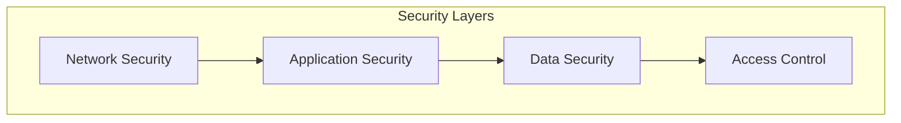
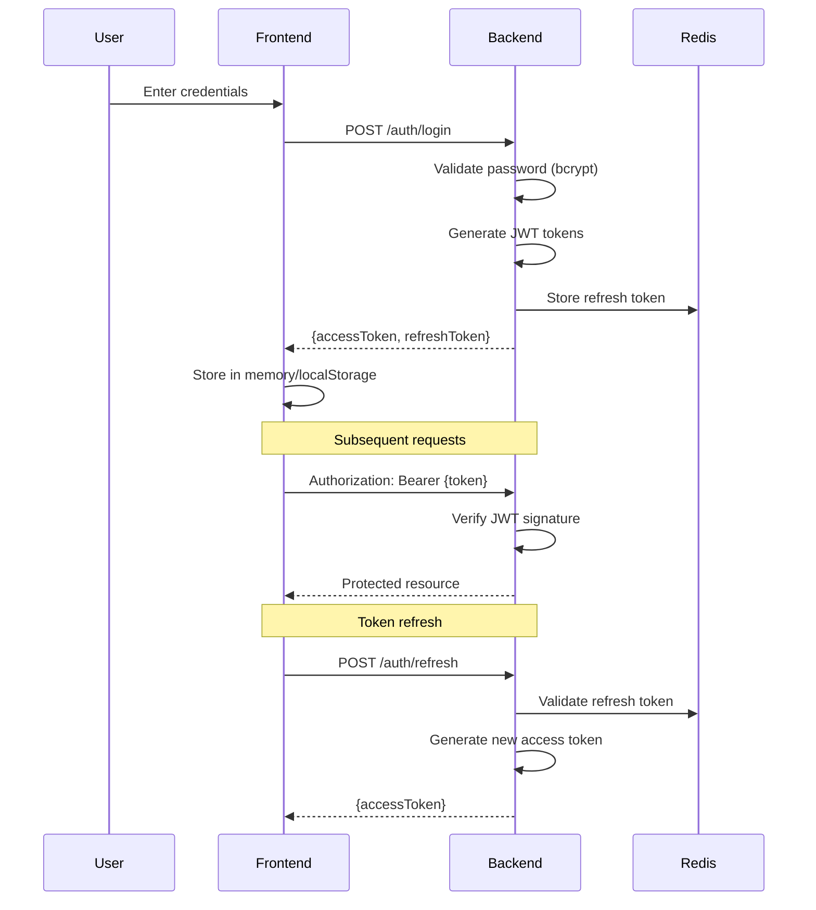
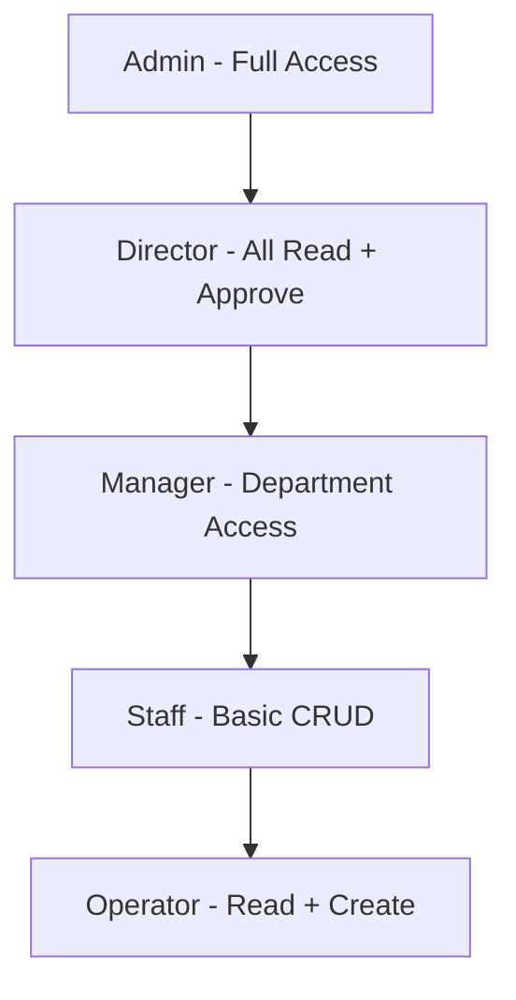
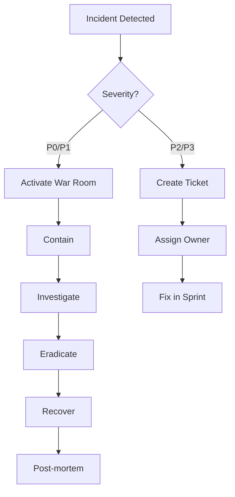

# 🔒 Security Specification

> **Parent Docs:** [Backend](backend.md), [API Contract](api-contract.md)
> **Last Updated:** 2024-12-27

---

## 1. Overview

Security adalah prioritas utama untuk sistem ERP manufacturing. Dokumen ini mencakup semua aspek keamanan dari authentication hingga compliance.



---

## 2. Authentication

### 2.1 JWT Token Flow



### 2.2 Token Configuration

| Token Type    | Lifetime | Storage | Revocable        |
| ------------- | -------- | ------- | ---------------- |
| Access Token  | 1 hour   | Memory  | No (short-lived) |
| Refresh Token | 7 days   | Redis   | Yes              |

### 2.3 Token Payload

```typescript
interface JwtPayload {
  sub: string;      // User UUID
  username: string;
  role: string;
  permissions: string[];
  iat: number;      // Issued at
  exp: number;      // Expiry
}
```

### 2.4 Password Requirements

| Requirement    | Rule                          |
| -------------- | ----------------------------- |
| Minimum length | 8 characters                  |
| Uppercase      | At least 1                    |
| Lowercase      | At least 1                    |
| Number         | At least 1                    |
| Special char   | At least 1 (!@#$%^&*)         |
| History        | Cannot reuse last 5 passwords |

### 2.5 Password Hashing

```typescript
// Using bcrypt with salt rounds = 12
const salt = await bcrypt.genSalt(12);
const hash = await bcrypt.hash(password, salt);
```

---

## 3. Authorization (RBAC)

### 3.1 Role Hierarchy



### 3.2 Permission Matrix

| Permission         | Admin | Director | Manager | Staff | Operator |
| ------------------ | ----- | -------- | ------- | ----- | -------- |
| **Dashboard**      |
| dashboard.view     | ✅     | ✅        | ✅       | ✅     | ✅        |
| **Users**          |
| user.read          | ✅     | ✅        | ✅       | ❌     | ❌        |
| user.create        | ✅     | ❌        | ❌       | ❌     | ❌        |
| user.update        | ✅     | ❌        | ❌       | ❌     | ❌        |
| user.delete        | ✅     | ❌        | ❌       | ❌     | ❌        |
| **Sales Order**    |
| so.read            | ✅     | ✅        | ✅       | ✅     | ✅        |
| so.create          | ✅     | ✅        | ✅       | ✅     | ❌        |
| so.update          | ✅     | ✅        | ✅       | ✅     | ❌        |
| so.delete          | ✅     | ✅        | ✅       | ❌     | ❌        |
| so.approve         | ✅     | ✅        | ✅       | ❌     | ❌        |
| **Purchase Order** |
| po.read            | ✅     | ✅        | ✅       | ✅     | ✅        |
| po.create          | ✅     | ✅        | ✅       | ✅     | ❌        |
| po.approve         | ✅     | ✅        | ❌       | ❌     | ❌        |
| **Work Order**     |
| wo.read            | ✅     | ✅        | ✅       | ✅     | ✅        |
| wo.create          | ✅     | ✅        | ✅       | ✅     | ❌        |
| wo.log_output      | ✅     | ✅        | ✅       | ✅     | ✅        |
| **Inventory**      |
| inv.read           | ✅     | ✅        | ✅       | ✅     | ✅        |
| inv.adjust         | ✅     | ✅        | ✅       | ❌     | ❌        |
| inv.transfer       | ✅     | ✅        | ✅       | ✅     | ❌        |
| **AI**             |
| ai.chat            | ✅     | ✅        | ✅       | ✅     | ❌        |
| ai.insights        | ✅     | ✅        | ✅       | ❌     | ❌        |
| **Reports**        |
| report.view        | ✅     | ✅        | ✅       | ✅     | ❌        |
| report.export      | ✅     | ✅        | ✅       | ❌     | ❌        |
| **Admin**          |
| admin.users        | ✅     | ❌        | ❌       | ❌     | ❌        |
| admin.roles        | ✅     | ❌        | ❌       | ❌     | ❌        |
| admin.audit        | ✅     | ✅        | ❌       | ❌     | ❌        |

### 3.3 Permission Guard (NestJS)

```typescript
@Injectable()
export class PermissionsGuard implements CanActivate {
  constructor(private reflector: Reflector) {}

  canActivate(context: ExecutionContext): boolean {
    const requiredPermissions = this.reflector.getAllAndOverride<string[]>(
      'permissions',
      [context.getHandler(), context.getClass()]
    );
    
    if (!requiredPermissions) return true;
    
    const { user } = context.switchToHttp().getRequest();
    return requiredPermissions.some(perm => 
      user.permissions?.includes(perm)
    );
  }
}
```

---

## 4. API Security

### 4.1 Rate Limiting

| Endpoint                 | Limit        | Window   |
| ------------------------ | ------------ | -------- |
| `/auth/login`            | 5 requests   | 1 minute |
| `/auth/forgot-password`  | 3 requests   | 1 hour   |
| `/api/*` (authenticated) | 100 requests | 1 minute |
| `/api/ai/chat`           | 10 requests  | 1 minute |

```typescript
// NestJS Throttler Configuration
ThrottlerModule.forRoot({
  ttl: 60,
  limit: 100,
}),

// Per-route override
@Throttle(5, 60)
@Post('login')
async login() { ... }
```

### 4.2 Input Validation

```typescript
// All inputs validated with class-validator
class CreateSalesOrderDto {
  @IsUUID()
  customerId: string;

  @IsDateString()
  orderDate: string;

  @IsArray()
  @ValidateNested({ each: true })
  @Type(() => CreateSOItemDto)
  items: CreateSOItemDto[];
  
  @IsOptional()
  @IsString()
  @MaxLength(500)
  notes?: string;
}
```

### 4.3 SQL Injection Prevention

```typescript
// Always use parameterized queries
const result = await this.dataSource.query(
  'SELECT * FROM t_so WHERE cust_id = $1',
  [customerId]  // Parameterized - SAFE
);

// NEVER do string interpolation
// const result = await this.dataSource.query(
//   `SELECT * FROM t_so WHERE cust_id = '${customerId}'`  // VULNERABLE
// );
```

### 4.4 XSS Prevention

```typescript
// Sanitize HTML output
import DOMPurify from 'dompurify';

const safeHtml = DOMPurify.sanitize(userInput);

// React automatically escapes
<div>{userInput}</div>  // Safe
<div dangerouslySetInnerHTML={{ __html: safeHtml }} />  // Use sanitized only
```

### 4.5 CORS Configuration

```typescript
// NestJS CORS
app.enableCors({
  origin: [
    'http://localhost:3000',
    'https://sentient.local',
  ],
  methods: ['GET', 'POST', 'PUT', 'DELETE'],
  allowedHeaders: ['Content-Type', 'Authorization'],
  credentials: true,
});
```

---

## 5. Data Protection

### 5.1 Encryption at Rest

| Data Type | Encryption     | Key Management    |
| --------- | -------------- | ----------------- |
| Database  | PostgreSQL TDE | Vault             |
| Backups   | AES-256        | Vault             |
| Files     | AES-256        | Vault             |
| Secrets   | Vault KV       | Vault Auto-Unseal |

### 5.2 Encryption in Transit

| Connection         | Protocol | Minimum Version |
| ------------------ | -------- | --------------- |
| Frontend ↔ Backend | TLS      | 1.2             |
| Backend ↔ Database | TLS      | 1.2             |
| Backend ↔ Redis    | TLS      | 1.2             |
| Internal services  | mTLS     | 1.3             |

### 5.3 PII Handling

| Data        | Classification | Handling             |
| ----------- | -------------- | -------------------- |
| Email       | PII            | Masked in logs       |
| Phone       | PII            | Masked in logs       |
| Password    | Sensitive      | Never logged, hashed |
| Credit Card | Sensitive      | Not stored           |
| Address     | PII            | Encrypted at rest    |

```typescript
// Mask PII in logs
function maskEmail(email: string): string {
  const [user, domain] = email.split('@');
  return `${user[0]}***@${domain}`;
}
// john.doe@example.com → j***@example.com
```

---

## 6. OWASP Top 10 Compliance

### 6.1 Compliance Checklist

| #   | Vulnerability                 | Status | Mitigation                        |
| --- | ----------------------------- | ------ | --------------------------------- |
| 1   | **Broken Access Control**     | ✅      | RBAC, Permission Guards           |
| 2   | **Cryptographic Failures**    | ✅      | TLS 1.2+, bcrypt, AES-256         |
| 3   | **Injection**                 | ✅      | Parameterized queries, Validation |
| 4   | **Insecure Design**           | ✅      | Threat modeling, Code review      |
| 5   | **Security Misconfiguration** | ✅      | Hardened containers, Vault        |
| 6   | **Vulnerable Components**     | ⚠️      | Dependabot, npm audit             |
| 7   | **Authentication Failures**   | ✅      | JWT, Rate limiting, MFA-ready     |
| 8   | **Integrity Failures**        | ✅      | Signed artifacts, SBOM            |
| 9   | **Logging Failures**          | ✅      | Audit logs, ELK stack             |
| 10  | **SSRF**                      | ✅      | URL allowlist, Input validation   |

### 6.2 Dependency Scanning

```yaml
# .github/workflows/security.yml

name: Security Scan

on:
  schedule:
    - cron: '0 0 * * *'  # Daily
  push:
    branches: [main]

jobs:
  scan:
    runs-on: ubuntu-latest
    steps:
      - uses: actions/checkout@v4
      
      - name: Run npm audit
        run: npm audit --audit-level=high
      
      - name: Run Snyk
        uses: snyk/actions/node@master
        env:
          SNYK_TOKEN: ${{ secrets.SNYK_TOKEN }}
      
      - name: Run Trivy
        uses: aquasecurity/trivy-action@master
        with:
          scan-type: 'fs'
          severity: 'HIGH,CRITICAL'
```

---

## 7. Audit Logging

### 7.1 Events to Log

| Event                     | Data Captured                        |
| ------------------------- | ------------------------------------ |
| Login success/failure     | User, IP, Timestamp, UserAgent       |
| Logout                    | User, Session duration               |
| Password change           | User, Timestamp                      |
| Permission change         | User, Old/New permissions, ChangedBy |
| Data create/update/delete | Entity, ID, Before/After, User       |
| Export/Download           | Report type, User, Timestamp         |
| AI Query                  | User, Query, Response summary        |

### 7.2 Audit Log Schema

```sql
CREATE TABLE log_audit (
  id BIGSERIAL PRIMARY KEY,
  event_type VARCHAR(50) NOT NULL,
  entity_type VARCHAR(50),
  entity_id BIGINT,
  user_id BIGINT REFERENCES m_user(id),
  username VARCHAR(100),
  ip_address INET,
  user_agent TEXT,
  old_values JSONB,
  new_values JSONB,
  description TEXT,
  created_at TIMESTAMPTZ DEFAULT NOW()
);

CREATE INDEX idx_audit_event ON log_audit(event_type);
CREATE INDEX idx_audit_user ON log_audit(user_id);
CREATE INDEX idx_audit_date ON log_audit(created_at);
```

### 7.3 Retention Policy

| Data Type     | Retention | Storage           |
| ------------- | --------- | ----------------- |
| Security logs | 2 years   | Encrypted archive |
| Audit logs    | 7 years   | Encrypted archive |
| Access logs   | 90 days   | ELK stack         |
| Debug logs    | 30 days   | Local/S3          |

---

## 8. Incident Response

### 8.1 Severity Levels

| Level             | Description        | Response Time | Example                |
| ----------------- | ------------------ | ------------- | ---------------------- |
| **P0 - Critical** | System compromised | 15 minutes    | Data breach, RCE       |
| **P1 - High**     | Potential breach   | 1 hour        | SQL injection attempt  |
| **P2 - Medium**   | Security concern   | 4 hours       | Unusual access pattern |
| **P3 - Low**      | Minor issue        | 24 hours      | Failed login spike     |

### 8.2 Response Plan



### 8.3 Emergency Contacts

| Role             | Contact     | Escalation Time  |
| ---------------- | ----------- | ---------------- |
| On-call Engineer | PagerDuty   | Immediate        |
| Tech Lead        | Phone/Slack | 15 min           |
| Security Team    | Email/Slack | 30 min           |
| CTO              | Phone       | 1 hour (P0 only) |

---

## 9. Security Headers

```typescript
// Helmet middleware configuration
app.use(helmet({
  contentSecurityPolicy: {
    directives: {
      defaultSrc: ["'self'"],
      styleSrc: ["'self'", "'unsafe-inline'"],
      scriptSrc: ["'self'"],
      imgSrc: ["'self'", "data:", "https:"],
    },
  },
  hsts: {
    maxAge: 31536000,
    includeSubDomains: true,
    preload: true,
  },
}));
```

### Response Headers

| Header                      | Value                               |
| --------------------------- | ----------------------------------- |
| `Strict-Transport-Security` | max-age=31536000; includeSubDomains |
| `X-Content-Type-Options`    | nosniff                             |
| `X-Frame-Options`           | DENY                                |
| `X-XSS-Protection`          | 1; mode=block                       |
| `Content-Security-Policy`   | default-src 'self'                  |
| `Referrer-Policy`           | strict-origin-when-cross-origin     |

---

## 10. Security Checklist

### Pre-Deployment

- [ ] All secrets in Vault
- [ ] TLS configured
- [ ] Rate limiting enabled
- [ ] CORS restricted
- [ ] Input validation complete
- [ ] SQL injection tested
- [ ] XSS tested
- [ ] Dependency scan passed
- [ ] Penetration test completed

### Post-Deployment

- [ ] Audit logging verified
- [ ] Monitoring alerts configured
- [ ] Backup encryption verified
- [ ] Incident response tested
- [ ] Security headers validated

---

*Document Version: 1.0*
*Last Updated: 2024-12-27*
