# 📊 Analisa Sistem & Arsitektur (System Analysis)

Dokumen ini adalah cetak biru teknis (Technical Blueprint) untuk pengembangan **Sentient Factory**, menggabungkan aturan dari `.cursorrules`, arsitektur, dan master prompting.

---

## 1. Desain Database (ERD Lengkap)

Database ini menggunakan **PostgreSQL** sebagai Data Warehouse (DW). Naming convention:
- `m_` = Master/Dimension Table
- `t_` = Transaction Table (Data Transaksi)
- `ai_` = AI Insight Table

### 1.1 Master Data (Dimension Tables)


### 1.2 Transaction Data (Tabel Transaksi)


### 1.4 Panduan Penggunaan ID vs UUID (Dual-ID Pattern)

Setiap **Transaction Table Utama** memiliki dua identifier:
- `id` (BIGINT) = Primary Key internal
- `uuid` (UUID) = Unique Key untuk eksposur eksternal

| Kapan Pakai                  | Gunakan | Contoh                                |
| ---------------------------- | ------- | ------------------------------------- |
| **Internal Query (Backend)** | `id`    | `SELECT * FROM t_so WHERE id = 12345` |
| **JOIN antar tabel**         | `id`    | `t_so.id = t_so_detail.so_id`         |
| **Report/Analytics**         | `id`    | Query lebih cepat untuk aggregasi     |
| **REST API Response**        | `uuid`  | `GET /api/orders/550e8400-e29b...`    |
| **WhatsApp Chat**            | `uuid`  | "Order `550e8400` sudah dikirim"      |
| **URL di Dashboard**         | `uuid`  | `/dashboard/order/550e8400-e29b...`   |
| **Webhook dari External**    | `uuid`  | Tracking dari ekspedisi (GLS, JNE)    |

**Kenapa Dual-ID?**

1.  **Security**: User tidak bisa menebak order lain dengan `id + 1`.
2.  **Performance**: JOIN internal tetap pakai BIGINT (lebih cepat).
3.  **Consistency**: Semua API publik selalu pakai UUID.

**Contoh Implementasi di NestJS:**

```typescript
// DTO Response (Eksternal) - Pakai UUID
class OrderResponseDto {
  uuid: string;  // ✅ Expose ini ke frontend
  customer: string;
  total: number;
}

// Service Internal - Pakai ID
async getOrderDetails(orderId: number) {
  return this.db.query(`
    SELECT * FROM t_so 
    JOIN t_so_detail ON t_so.id = t_so_detail.so_id
    WHERE t_so.id = $1
  `, [orderId]); // ✅ Pakai id untuk performa
}

// Controller - Terima UUID, Convert ke ID
@Get(':uuid')
async findOne(@Param('uuid') uuid: string) {
  const order = await this.orderService.findByUuid(uuid);
  return new OrderResponseDto(order);
}
```

---

### 1.5 AI & Insight Tables


---

### 1.6 Aturan Desain Database (Database Design Standards)

Panduan ini wajib diikuti oleh seluruh developer saat membuat atau memodifikasi tabel.

#### A. Naming Convention (Penamaan)

| Elemen          | Aturan                                             | Contoh                             |
| --------------- | -------------------------------------------------- | ---------------------------------- |
| **Table Name**  | `prefix_namasingkat` (lowercase, snake_case)       | `m_cust`, `t_so`, `ai_insight`     |
| **Column Name** | `namasingkat` (lowercase, snake_case, max 15 char) | `order_dt`, `total_amt`, `cust_id` |
| **Primary Key** | Selalu `id`                                        | `id BIGINT`                        |
| **Foreign Key** | `[tabel_tujuan]_id`                                | `cust_id`, `item_id`, `so_id`      |
| **Unique Key**  | `code` atau `uuid`                                 | `code VARCHAR UK`                  |
| **Timestamp**   | Suffix `_at` atau `_ts`                            | `created_at`, `updated_at`         |
| **Date Only**   | Suffix `_dt`                                       | `order_dt`, `ship_dt`              |
| **Boolean**     | Prefix `is_` atau `has_`                           | `is_active`, `has_paid`            |

#### B. Kapan Pakai ID vs UUID

| Kolom  | Tipe       | Kapan Dipakai                                                      |
| ------ | ---------- | ------------------------------------------------------------------ |
| `id`   | BIGINT     | **Selalu ada** di setiap tabel sebagai PK (performa JOIN)          |
| `uuid` | UUID UK    | Hanya di tabel yang **di-expose ke API/User** (t_so, t_po, m_user) |
| `code` | VARCHAR UK | **Master Table** yang punya kode bisnis (CUST-001, ITM-001)        |

**Aturan:**
1.  Internal Query (Backend SQL) → Pakai `id`
2.  Eksternal API (REST/WA) → Pakai `uuid` atau `code`
3.  Detail Table (t_so_detail) → Tidak perlu `uuid` karena tidak di-expose langsung

#### C. Data Type Guidelines

| Tipe Data      | Kapan Dipakai                      | Contoh Kolom                       |
| -------------- | ---------------------------------- | ---------------------------------- |
| `BIGINT`       | Primary Key, Foreign Key, Counter  | `id`, `so_id`, `qty` (besar)       |
| `INT`          | Angka kecil (< 2 miliar)           | `qty`, `recency_days`              |
| `NUMERIC(p,s)` | Uang, Persentase (presisi penting) | `total_amt`, `disc_pct`, `price`   |
| `VARCHAR(n)`   | Teks pendek (nama, kode, status)   | `name`, `code`, `status`           |
| `TEXT`         | Teks panjang (JSON, deskripsi AI)  | `context_json`, `reasoning`        |
| `DATE`         | Tanggal saja (tanpa jam)           | `order_dt`, `ship_dt`, `due_dt`    |
| `TIMESTAMP`    | Tanggal + Waktu (event log)        | `created_at`, `last_login`, `ts`   |
| `BOOLEAN`      | True/False                         | `is_active`, `is_resolved`, `sent` |
| `UUID`         | Identifier eksternal (random)      | `uuid`                             |

#### D. Aturan DATE vs TIMESTAMP

| Gunakan     | Kapan                                                             |
| ----------- | ----------------------------------------------------------------- |
| `DATE`      | Data bisnis yang hanya butuh tanggal (deadline, jadwal, due date) |
| `TIMESTAMP` | Event log yang butuh presisi waktu (created_at, login, audit)     |

**Contoh:**
```sql
-- DATE: Kapan order harus dikirim (tidak peduli jam)
deadline_dt DATE

-- TIMESTAMP: Kapan user terakhir login (butuh jam:menit:detik)
last_login TIMESTAMP WITH TIME ZONE
```

#### E. Kolom Audit Wajib (Audit Trail Columns)

Setiap tabel transaksional (`t_*`) dan tabel penting **wajib** memiliki kolom audit untuk traceability dan compliance.

| Kolom        | Tipe             | Fungsi                | Standar                         |
| ------------ | ---------------- | --------------------- | ------------------------------- |
| `id`         | BIGINT PK        | Primary Key internal  | Auto-increment                  |
| `created_at` | TIMESTAMPTZ      | Kapan record dibuat   | Default NOW(), **Never Update** |
| `created_by` | BIGINT FK        | Siapa yang membuat    | FK ke m_user.id                 |
| `updated_at` | TIMESTAMPTZ      | Kapan terakhir diubah | Auto-update via Trigger         |
| `updated_by` | BIGINT FK        | Siapa yang mengubah   | FK ke m_user.id                 |
| `deleted_at` | TIMESTAMPTZ NULL | Kapan di-soft delete  | NULL = aktif, Filled = deleted  |
| `deleted_by` | BIGINT FK NULL   | Siapa yang menghapus  | FK ke m_user.id                 |

**Best Practices (Performance-First):**

1.  **TIMESTAMPTZ (Timestamp With Time Zone)**
    *   Pakai `TIMESTAMPTZ` bukan `TIMESTAMP` untuk support multi-timezone.
    *   Simpan selalu dalam **UTC**, konversi ke local di aplikasi.
    *   Ini sesuai standar **ISO 8601** dan **RFC 3339**.

2.  **Soft Delete (Logical Delete)**
    *   Jangan pakai `DELETE` langsung, isi `deleted_at` saja.
    *   Data bisa di-recover, audit trail terjaga.
    *   Tambahkan **Partial Index** untuk performa:

```sql
-- Index hanya untuk data aktif (deleted_at IS NULL)
CREATE INDEX idx_t_so_active ON t_so(id) WHERE deleted_at IS NULL;
```

3.  **created_by / updated_by sebagai BIGINT**
    *   Pakai FK ke `m_user.id` (bukan username/email).
    *   Lebih hemat storage dan konsisten.

**Template SQL Lengkap:**
```sql
CREATE TABLE t_example (
    -- Primary Key
    id BIGINT GENERATED ALWAYS AS IDENTITY PRIMARY KEY,
    uuid UUID DEFAULT gen_random_uuid() UNIQUE,
    
    -- Kolom bisnis di sini --
    cust_id BIGINT REFERENCES m_cust(id),
    total_amt NUMERIC(15,2),
    status VARCHAR(20) DEFAULT 'Open',
    
    -- Audit Columns (Wajib)
    created_at TIMESTAMPTZ DEFAULT NOW(),
    created_by BIGINT REFERENCES m_user(id),
    updated_at TIMESTAMPTZ DEFAULT NOW(),
    updated_by BIGINT REFERENCES m_user(id),
    deleted_at TIMESTAMPTZ NULL,
    deleted_by BIGINT REFERENCES m_user(id)
);

-- Function untuk auto-update updated_at
CREATE OR REPLACE FUNCTION trigger_set_timestamp()
RETURNS TRIGGER AS $$
BEGIN
    NEW.updated_at = NOW();
    RETURN NEW;
END;
$$ LANGUAGE plpgsql;

-- Trigger auto-update updated_at
CREATE TRIGGER set_updated_at
    BEFORE UPDATE ON t_example
    FOR EACH ROW
    EXECUTE FUNCTION trigger_set_timestamp();

-- Partial Index untuk query data aktif (Performance)
CREATE INDEX idx_t_example_active ON t_example(id) WHERE deleted_at IS NULL;
```

**Kapan Tabel Butuh Audit Column?**

| Tipe Tabel          | Butuh Audit? | Alasan                                |
| ------------------- | ------------ | ------------------------------------- |
| `t_*` (Transaction) | ✅ **Wajib**  | Semua transaksi harus traceable       |
| `m_*` (Master)      | ✅ **Wajib**  | Perubahan master data harus dilog     |
| `ai_*` (AI Insight) | ⚠️ Opsional   | Cukup `created_at`, jarang di-update  |
| `log_*` (Event Log) | ❌ Tidak      | Immutable, tidak pernah update/delete |

---

### 1.7 Administrator Module (User & Access Management)

Modul Administrator mengelola **User**, **Hak Akses**, **Menu**, dan **Audit** untuk keamanan dan kontrol sistem.

#### A. Fitur Inti Administrator

| Fitur                     | Deskripsi                                                  | Priority |
| ------------------------- | ---------------------------------------------------------- | -------- |
| **User Management**       | CRUD user, reset password, aktivasi/deaktivasi             | P0       |
| **Role Management**       | Buat role (Admin, Manager, Operator, dll)                  | P0       |
| **Permission Management** | Definisi hak akses granular (create, read, update, delete) | P0       |
| **Menu Management**       | Konfigurasi menu sidebar dinamis per role                  | P1       |
| **Session Management**    | Lihat user aktif, force logout, session timeout            | P1       |
| **Audit Log**             | Log semua aksi user (siapa, kapan, apa)                    | P0       |
| **Password Policy**       | Aturan password (min length, complexity, expiry)           | P2       |
| **2FA (Two-Factor Auth)** | OTP via WhatsApp/Email untuk login sensitif                | P2       |

#### B. ERD Administrator Module


#### C. Alur Kerja (Flow)

**1. Login Flow:**
```
User → Input Username/Password
     → Cek is_active = TRUE
     → Cek locked_until < NOW()
     → Verify password_hash
     → Jika gagal: failed_login_count++
     → Jika gagal 5x: locked_until = NOW() + 30 min
     → Jika sukses: Create adm_session, Log to log_audit
```

**2. Access Control Flow (Setiap Request):**
```
Request → Extract JWT Token
       → Cek adm_session (valid, not revoked, not expired)
       → Get user.role_id
       → Get permissions via adm_role_permission
       → Check if action allowed (e.g., SO.CREATE)
       → Allow or Deny (403 Forbidden)
```

**3. Menu Loading Flow:**
```
Frontend → GET /api/menus
        → Backend: Get user.role_id
        → Query adm_role_menu + adm_menu
        → Filter by is_active = TRUE
        → Sort by parent_id, sort_order
        → Return nested menu tree
```

#### D. Contoh Permission Codes

| Module             | Permission Code        | Deskripsi                |
| ------------------ | ---------------------- | ------------------------ |
| **Sales Order**    | `SO.CREATE`            | Buat SO baru             |
|                    | `SO.READ`              | Lihat list SO            |
|                    | `SO.UPDATE`            | Edit SO                  |
|                    | `SO.DELETE`            | Hapus SO                 |
|                    | `SO.APPROVE`           | Approve SO               |
|                    | `SO.EXPORT`            | Export SO ke Excel/PDF   |
| **Purchase Order** | `PO.CREATE`            | Buat PO baru             |
|                    | `PO.APPROVE`           | Approve PO               |
| **Administrator**  | `ADMIN.USER.CREATE`    | Buat user baru           |
|                    | `ADMIN.USER.RESET_PWD` | Reset password user      |
|                    | `ADMIN.ROLE.MANAGE`    | Kelola role & permission |
|                    | `ADMIN.AUDIT.VIEW`     | Lihat audit log          |

#### E. Contoh Role Default

| Role Code       | Nama               | Level | Deskripsi                |
| --------------- | ------------------ | ----- | ------------------------ |
| `SYSADMIN`      | System Admin       | 1     | Full access semua modul  |
| `DIRECTOR`      | Direktur           | 5     | Read all, Approve all    |
| `MANAGER_SALES` | Sales Manager      | 10    | Full SO, Read PO/WO      |
| `MANAGER_PROD`  | Production Manager | 10    | Full WO, Read SO         |
| `STAFF_SALES`   | Sales Staff        | 50    | Create/Read SO           |
| `STAFF_WH`      | Warehouse Staff    | 50    | Read/Update Inventory    |
| `OPERATOR`      | Operator Produksi  | 80    | Read WO, Input shift_log |
| `READONLY`      | Read Only          | 99    | Read all, No edit        |

---

### 1.8 Sample Data (Dummy Data untuk UI/UX Team)

Data berikut digunakan oleh tim UI/UX untuk mendesain layout tabel, form, dan dashboard.

---

#### A. Master Data

##### m_cust (Customer)
```json
[
  {"id": 1, "code": "CUST-001", "name": "PT ABC Manufacturing", "segment": "VIP", "credit_lim": 500000000},
  {"id": 2, "code": "CUST-002", "name": "CV XYZ Trading", "segment": "Regular", "credit_lim": 100000000},
  {"id": 3, "code": "CUST-003", "name": "PT Maju Jaya", "segment": "VIP", "credit_lim": 750000000},
  {"id": 4, "code": "CUST-004", "name": "UD Sentosa", "segment": "Regular", "credit_lim": 50000000},
  {"id": 5, "code": "CUST-005", "name": "PT Global Tech", "segment": "VIP", "credit_lim": 1000000000}
]
```

##### m_item (Product)
```json
[
  {"id": 1, "code": "ITM-001", "name": "Widget Pro X1", "category": "Finished Goods", "cost": 45000, "price": 65000, "uom": "PCS"},
  {"id": 2, "code": "ITM-002", "name": "Component Alpha", "category": "Raw Material", "cost": 12500, "uom": "KG"},
  {"id": 3, "code": "ITM-003", "name": "Assembly Kit B", "category": "WIP", "cost": 85000, "price": 125000, "uom": "SET"},
  {"id": 4, "code": "ITM-004", "name": "Steel Plate 3mm", "category": "Raw Material", "cost": 75000, "uom": "LBR"},
  {"id": 5, "code": "ITM-005", "name": "Motor DC 12V", "category": "Component", "cost": 150000, "price": 220000, "uom": "PCS"}
]
```

##### m_vendor (Supplier)
```json
[
  {"id": 1, "code": "VND-001", "name": "PT Baja Makmur", "addr": "Cikarang, Bekasi", "otd": 92.5, "quality": 88.0},
  {"id": 2, "code": "VND-002", "name": "CV Jaya Abadi", "addr": "Tangerang", "otd": 85.0, "quality": 91.0},
  {"id": 3, "code": "VND-003", "name": "PT Global Supply", "addr": "Surabaya", "otd": 78.5, "quality": 82.0}
]
```

##### m_machine (Equipment)
```json
[
  {"id": 1, "code": "MCH-001", "name": "CNC Milling A1", "location": "Plant 1 - Line A", "capacity": 120, "hours": 8540},
  {"id": 2, "code": "MCH-002", "name": "Injection Molding B2", "location": "Plant 1 - Line B", "capacity": 200, "hours": 12350},
  {"id": 3, "code": "MCH-003", "name": "Welding Robot C1", "location": "Plant 2", "capacity": 80, "hours": 5200}
]
```

##### m_wh (Warehouse)
```json
[
  {"id": 1, "code": "WH-A1", "name": "Gudang Bahan Baku", "zone": "A", "capacity_m3": 5000},
  {"id": 2, "code": "WH-B1", "name": "Gudang Finished Goods", "zone": "B", "capacity_m3": 3500},
  {"id": 3, "code": "WH-C1", "name": "Gudang WIP", "zone": "C", "capacity_m3": 2000}
]
```

---

#### B. Transaction Data

##### t_so (Sales Order)
```json
[
  {"id": 1, "no": "SO-202412-0001", "cust": "PT ABC Manufacturing", "date": "2024-12-20", "total": 32500000, "status": "Approved"},
  {"id": 2, "no": "SO-202412-0002", "cust": "PT Maju Jaya", "date": "2024-12-22", "total": 125000000, "status": "Pending"},
  {"id": 3, "no": "SO-202412-0003", "cust": "CV XYZ Trading", "date": "2024-12-25", "total": 18750000, "status": "Draft"},
  {"id": 4, "no": "SO-202412-0004", "cust": "PT Global Tech", "date": "2024-12-27", "total": 450000000, "status": "Approved"}
]
```

##### t_so_detail (SO Line Items)
```json
[
  {"so": "SO-202412-0001", "item": "Widget Pro X1", "qty": 500, "price": 65000, "disc": "0%", "subtotal": 32500000},
  {"so": "SO-202412-0002", "item": "Widget Pro X1", "qty": 1000, "price": 65000, "disc": "5%", "subtotal": 61750000},
  {"so": "SO-202412-0002", "item": "Assembly Kit B", "qty": 500, "price": 125000, "disc": "0%", "subtotal": 62500000},
  {"so": "SO-202412-0004", "item": "Motor DC 12V", "qty": 2000, "price": 220000, "disc": "2%", "subtotal": 431200000}
]
```

##### t_po (Purchase Order)
```json
[
  {"id": 1, "no": "PO-202412-0001", "vendor": "PT Baja Makmur", "date": "2024-12-18", "total": 75000000, "status": "Approved"},
  {"id": 2, "no": "PO-202412-0002", "vendor": "CV Jaya Abadi", "date": "2024-12-20", "total": 45000000, "status": "Pending Director"},
  {"id": 3, "no": "PO-202412-0003", "vendor": "PT Global Supply", "date": "2024-12-25", "total": 12500000, "status": "Draft"}
]
```

##### t_do (Delivery Order)
```json
[
  {"id": 1, "no": "DO-202412-0001", "so_ref": "SO-202412-0001", "ship_date": "2024-12-22", "status": "Delivered", "driver": "Pak Budi"},
  {"id": 2, "no": "DO-202412-0002", "so_ref": "SO-202412-0004", "ship_date": "2024-12-28", "status": "In Transit", "driver": "Pak Joko"}
]
```

##### t_wo (Work Order)
```json
[
  {"id": 1, "no": "WO-202412-0001", "item": "Widget Pro X1", "machine": "CNC Milling A1", "target": 1000, "actual": 980, "status": "Completed"},
  {"id": 2, "no": "WO-202412-0002", "item": "Assembly Kit B", "machine": "Injection Molding B2", "target": 500, "actual": 320, "status": "In Progress"},
  {"id": 3, "no": "WO-202412-0003", "item": "Motor DC 12V", "machine": "Welding Robot C1", "target": 2000, "actual": 0, "status": "Scheduled"}
]
```

##### t_inv (Inventory Stock)
```json
[
  {"item": "Widget Pro X1", "wh": "WH-B1", "on_hand": 2500, "reserved": 500, "available": 2000, "status": "🟢 OK"},
  {"item": "Component Alpha", "wh": "WH-A1", "on_hand": 850, "reserved": 0, "available": 850, "status": "🟢 OK"},
  {"item": "Assembly Kit B", "wh": "WH-C1", "on_hand": 320, "reserved": 100, "available": 220, "status": "🟡 Low"},
  {"item": "Steel Plate 3mm", "wh": "WH-A1", "on_hand": 150, "reserved": 50, "available": 100, "status": "🟡 Low"},
  {"item": "Motor DC 12V", "wh": "WH-B1", "on_hand": 1800, "reserved": 2000, "available": -200, "status": "🔴 Oversold"}
]
```

---

#### C. Admin Data

##### adm_user (User Account)
```json
[
  {"id": 1, "username": "admin", "email": "admin@factory.local", "role": "System Admin", "active": true, "last_login": "2024-12-27 10:30"},
  {"id": 2, "username": "john.doe", "email": "john@factory.local", "role": "Sales Manager", "active": true, "last_login": "2024-12-27 09:15"},
  {"id": 3, "username": "jane.smith", "email": "jane@factory.local", "role": "Production Mgr", "active": true, "last_login": "2024-12-26 16:45"},
  {"id": 4, "username": "operator1", "email": "op1@factory.local", "role": "Operator", "active": true, "last_login": "2024-12-27 07:00"},
  {"id": 5, "username": "resigned", "email": "ex@factory.local", "role": "Sales Staff", "active": false, "last_login": "2024-10-15 08:00"}
]
```

##### adm_role (Role)
```json
[
  {"id": 1, "code": "SYSADMIN", "name": "System Admin", "level": 1, "is_system": true},
  {"id": 2, "code": "DIRECTOR", "name": "Direktur", "level": 5, "is_system": true},
  {"id": 3, "code": "MANAGER_SALES", "name": "Sales Manager", "level": 10, "is_system": false},
  {"id": 4, "code": "MANAGER_PROD", "name": "Production Manager", "level": 10, "is_system": false},
  {"id": 5, "code": "STAFF_SALES", "name": "Sales Staff", "level": 50, "is_system": false},
  {"id": 6, "code": "STAFF_WH", "name": "Warehouse Staff", "level": 50, "is_system": false},
  {"id": 7, "code": "OPERATOR", "name": "Operator", "level": 80, "is_system": false}
]
```

---

#### D. AI & Insight Data

##### ai_alert (Active Alerts)
```json
[
  {"id": 1, "type": "ANOMALY", "severity": "🔴 High", "message": "Reject rate MCH-003 = 8.5% (threshold: 5%)", "read": false},
  {"id": 2, "type": "CASHFLOW", "severity": "🔴 Critical", "message": "Saldo kas negatif dalam 7 hari", "read": false},
  {"id": 3, "type": "OVERDUE", "severity": "🟡 Medium", "message": "3 customer piutang > 30 hari", "read": true},
  {"id": 4, "type": "STOCK", "severity": "🟡 Medium", "message": "ITM-005 oversold (-200)", "read": false}
]
```

##### log_audit (Recent Activity)
```json
[
  {"time": "2024-12-27 14:30", "user": "john.doe", "action": "CREATE", "entity": "t_so #4", "ip": "192.168.1.100"},
  {"time": "2024-12-27 14:28", "user": "jane.smith", "action": "APPROVE", "entity": "t_po #1", "ip": "192.168.1.105"},
  {"time": "2024-12-27 14:25", "user": "admin", "action": "UPDATE", "entity": "adm_user #5", "ip": "192.168.1.1"},
  {"time": "2024-12-27 09:15", "user": "john.doe", "action": "LOGIN", "entity": "-", "ip": "192.168.1.100"}
]
```

---

#### E. Dashboard Summary (API Response)

```json
{
  "revenue_mtd": 625750000,
  "revenue_last_month": 580000000,
  "revenue_growth_pct": 7.9,
  "pending_orders": 2,
  "pending_approvals": 1,
  "production_oee": 87.5,
  "active_alerts": 3,
  "alerts_critical": 2,
  "alerts_warning": 1,
  "cash_balance": 1250000000,
  "ar_overdue": 185000000,
  "ap_due_7_days": 120000000
}
```

---

## 2. Konsep Prompting (The Brain Interface)

Sistem menggunakan pendekatan **"Sandwich Prompting"** yang terstandarisasi di `master_prompting.md`.

### Struktur Prompt (Dikirim dari Python ke LLM)
1.  **System Prefix (Layer Keamanan & Persona)**:
    *   *Inject Role*: "Anda adalah Senior Factory Manager."
    *   *Inject Guardrails*: "Dilarang menyarankan bypass sensor keamanan." (Safety First).
2.  **Dynamic Context (Data Tengah)**:
    *   Data diambil real-time dari PostgreSQL.
    *   Contoh: "User bertanya tentang Order #123. Status saat ini: Delay 3 hari."
    *   *Tone Adaptation*: Jika User = Operator, bahasa teknis. Jika User = CEO, bahasa uang.
3.  **Output Suffix (Format Jawaban)**:
    *   *Instruction*: "Jawab dalam format JSON" atau "Gunakan metode BLUF (Bottom Line Up Front)."

---

## 3. Authentication & Authorization (Keamanan Akses)

Menggunakan prinsip **Role-Based Access Control (RBAC)** ketat karena data pabrik sangat sensitif.

### Skema Login
*   **Web Dashboard (Metronic)**:
    *   Menggunakan **JWT (JSON Web Token)**.
    *   Masa berlaku token pendek (15 menit) + Refresh Token.
    *   **Level Akses**:
        *   `Director`: Full Access + Executive Summary.
        *   `Manager`: Edit Data + Detailed Report.
        *   `Operator`: Read Only (Input Log Produksi).

*   **WhatsApp Gateway (Executive Hub)**:
    *   **Whitelist Number**: Hanya nomor HP terdaftar di database yang bisa chat.
    *   **2FA Challenge**: Jika nomor baru/ganti HP, sistem akan kirim OTP ke Email perusahaan.

---

## 4. Security Architecture (Zero Trust)

Sesuai filosofi "Hybrid Secured", keamanan data adalah prioritas absolut.

### A. Network Security
*   **Air-Gapped Logic**: Node AI (Mac Mini) tidak punya akses internet bebas. Hanya boleh akses keluar ke whitelist domain (berita finansial/kurs) via Proxy di Node B.
*   **VLAN Isolation**: Server Manufacturing dipisah dari Wi-Fi tamu/kantor umum.

### B. Data Security
*   **Encryption at Rest**: Hard disk server dienkripsi (FileVault/LUKS).
*   **Encryption in Transit**: Komunikasi antara Frontend -> Backend -> AI menggunakan **TLS 1.3**.
*   **PII Masking**: Nama karyawan/gaji disamarkan (*masked*) sebelum dikirim ke prompt LLM (jika menggunakan cloud fallback).

---

## 5. Komunikasi Microservice

Sistem ini modular (Split Architecture) untuk keandalan tinggi.


*   **NestJS**: Pintu gerbang utama. Menangani validasi user dan bisnis logic.
*   **Python**: "Otak Murni". Hanya dipanggil saat butuh reasoning kompleks.
*   **NATS**: Message Broker utama untuk komunikasi antar service (Pub-Sub & Request-Reply).
*   **Node-RED**: "Jantung Detak". Menjalankan tugas rutin (Tarik data ERP tiap 10 menit).

### 5.1 Flow CDC/Sync ke Database Client (Legacy ERP)

Diagram ini menjelaskan bagaimana data dari **Legacy ERP** (milik Client) disinkronkan ke **PostgreSQL Data Warehouse** tanpa mengganggu performa sistem ERP asli.

```mermaid
sequenceDiagram
    participant ERP as "🗄️ Legacy ERP (Client DB)"
    participant CDC as "🔄 CDC Agent (Debezium/Custom)"
    participant NATS as "📬 NATS JetStream"
    participant ETL as "🐍 Python ETL Worker"
    participant PG as "🐘 PostgreSQL DW"

    Note over ERP, CDC: Proses Berjalan Setiap 10 Menit (Configurable)

    loop Incremental Sync
        CDC->>ERP: SELECT * WHERE updated_at > last_sync
        ERP-->>CDC: Changed Rows (Delta Data)
        CDC->>NATS: Publish Change Events
        NATS-->>ETL: Consume Events (JetStream)
        ETL->>ETL: Transform & Clean Data
        ETL->>PG: UPSERT ke Tabel Fact/Dim
    end

    Note over PG: Data Siap untuk AI Analysis
```



**Penjelasan Komponen:**
1.  **CDC Agent**: Membaca perubahan data dari ERP menggunakan metode *Change Data Capture* (polling `updated_at` atau *log-based* jika didukung).
2.  **NATS JetStream**: Antrian pesan *durable* untuk memisahkan proses baca dan tulis (*Decoupling*). Mendukung replay dan consumer groups.
3.  **ETL Worker**: Python script yang membersihkan data (normalisasi, konversi tipe) sebelum masuk ke DW.
4.  **Non-Intrusive**: Proses ini hanya **READ** dari ERP, tidak pernah **WRITE**. ERP Legacy tetap aman.

### 5.2 Fitur NATS yang Digunakan (All-in-One Messaging)

| Fungsi                | Fitur NATS     | Keterangan                                          |
| --------------------- | -------------- | --------------------------------------------------- |
| **CDC Stream**        | NATS JetStream | Durable stream, replay, at-least-once delivery      |
| **Job Queue**         | NATS JetStream | Work Queue pattern dengan consumer groups           |
| **Real-time Pub-Sub** | NATS Core      | Ultra-fast pub-sub untuk notifikasi (< 1ms latency) |
| **Simple Cache/KV**   | NATS KV Store  | Key-Value store untuk caching sederhana             |

**Keuntungan All-in-One NATS:**
1.  Satu service untuk semua messaging (operasional lebih simpel).
2.  Footprint kecil (single binary ~15MB).
3.  Native support di NestJS (`@nestjs/microservices`).

## 6. Elemen Tambahan (The Missing Pieces)

Hal-hal teknis yang dibutuhkan agar sistem siap produksi (*Production Ready*).

### A. Error Handling & Fallback
*   **Circuit Breaker**: Jika AI (Mac Mini) mati/overheat, Dashboard tetap jalan menampilkan data historis (Mode "Dumb Dashboard").
*   **Retry Mechanism**: Jika query database gagal, coba ulang 3x dengan *exponential backoff*.

### B. Monitoring & Observability
*   **Grafana Dashboard**: Memantau:
    *   CPU/RAM Mac Mini (Health Check).
    *   Token per Second (Kecepatan AI menjawab).
    *   User Login Activity (Audit Trail).
*   **Log Retention**: Log chat dan anomali disimpan 90 hari, lalu di-archive ke Cold Storage.

### C. Deployment Strategy (Dockerized)
Semua komponen dibungkus dalam Docker Container agar mudah dipindah/install ulang.
*   `container-frontend`: Nginx + Static Files
*   `container-backend`: NestJS
*   `container-ai`: Python + vLLM/Ollama
*   `container-db`: PostgreSQL 16
